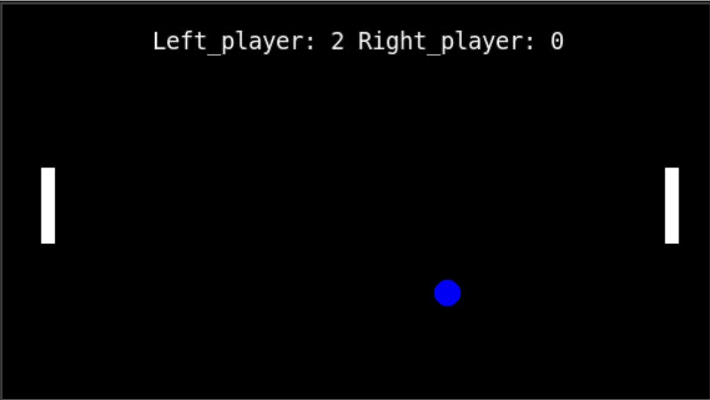

# Part A - An Introduction to Python

Hop on over to [this website](https://replit.com/join/ezeljogxsx-wiewinnipeg) where we can try out some coding.

You should see a page that looks something like this:



On the left-hand side is the **Files** tab. 

You should see a list of files that have already been added to our project.
Any file that ends in *.py* is a Python program file.

Click on the file *lesson1.py* to open it.

This is where we'll write our code for the first part of the workshop. 
Notice that the lines in the file are all numbered. Lines of code get read in order one by one. 
Any line that begins with a **#** gets ignored. This allows us to write *comments* in our code file. 
Comments are like notes to ourselves or others that help explain what's going on in the code.

On the right-hand side of the screen there are three tabs: **Console**, **Shell** and **Markdown**.

Click to open the **Console** tab. This will allow us to see any *output* from our program.


## Lesson 1: Variables and Loops
Any programming language is a way for us to give instructions to and interact with a computer. 
Assigning variables in Python is similar to assigning variables in math class. 
For example,

```python
x = 2
```
The name of the variable goes on the left-hand side, before the equals sign (=), and the value we want to give it 
goes on the right. Once defined, we can use these variables by name:

```python
y = x * 5
```
We can use the **print** function to convert values into text that we can see in the **Console**. 
It's a useful tool for understanding what's happening at a specific point in our code.
Let's add some **print statements** to our code.

```python
print(x)
print(x + 12)
print(y)
```

Pressing the green **Run** button at the top of the screen tells the Python engine in the background to run 
all of the code that's in the file, line by line, starting from the top.

The output should look something like this:
```commandline
> python lesson1.py
2
14
10
```

The first line in the block above is what told the computer which file to run, and to run it using Python.
The next lines are the output of our print statements.

We can name variables whatever we want (using letters, numbers and underscores), 
and can also have variables with values that aren't numbers!
```python
name = "Hannah"  # note the "" around my name (this is called a STRING)
my_dogs = ["Jax", "Ozzy"]  # putting things inside [] makes a LIST
```

We can access the items in a list using *indexing*:
```python
print(my_dogs[1])  # this has an unexpected result! (Python uses 0-based indexing)
```

We can also find out how many items are in a list using the **len** function:
```python
print(len(my_dogs))
```
What if I had a long list of dog names, and wanted to print them all?
There is a much faster way than:
```python
print(my_dogs[0])
print(my_dogs[1])
print(my_dogs[2])
...
print(my_dogs[99])
```
The more efficient way is to use a **loop**. There are two different kinds of loops in Python that we will cover.

A **for loop** looks like this:
```python
for number in range(1, 5):
    print(number)
```
Pay special attention to the colon (:) at the end of the first line, and the fact that the next line is indented.
These two things are part of Python's syntax rules.

Also notice that when we use the **range** function, the `number` variable starts at the provided start point (1)
and goes up to, *but does not include*, the provided end point (5).
If we want the index to start at 0, we don't need to provide a start point at all.
Eg. `range(5)` is equivalent to `range(0, 5)`.

The looping variable doesn't have to be a number either; we can loop through each of the items in a list like this:
```python
for dog in my_dogs:
    print(f"{dog} is a good boy!")
```

We can also use the **len** function to loop through the items in a list by index, rather than the items themselves.
```python
x_list = [5, 14, 23]
y_list = [3, 40, 12]
for index in range(len(x_list)):
    print(x_list[index] + y_list[index])
```

A **while loop** has similar behaviour, but is controlled a little differently.
The lines in a while loop get executed over and over again until the while (*statement*) part is no longer true.
```python
countdown = 10
while countdown > 0:
    print(countdown)
    countdown = countdown - 1
print("Blast Off!!!!")
```

A key difference between **for** and **while** loops is that a **for loop** runs for a pre-determined number of iterations
(the index variable gets incremented automatically), whereas a **while loop** could run forever -
we're in charge of stopping it by changing the value of the loop variable

___
>### *Coding Challenge #1*
>- Define three new variables: *name* (your name), *city* (where you were born), and *year* (when you were born).
>
>- Use the **print** function to display:                                   
>  `<your name> was born in <city> in <year>`       
___
>### *Coding Challenge #2*
>- Predict the value of the `direction` variable after the following lines of code are executed:
>     ```python
>    initial = "left"
>    direction = initial
>    initial = "right"
>    ```
>- Was your prediction correct? Try it out and see.
___

## Lesson 2: Conditionals (If / Else)

Sometimes we only want to execute a particular block of code under certain conditions.
For example, what if we only wanted to print numbers less than or equal to 5 in our countdown?
We can do that using an **if** statement. 
The indented block after the **if** only gets executed if the statement is **true**.
```python
countdown = 10
print("Counting down...")
while countdown > 0:
    if countdown <= 5:  # Note the colon (:) and indent!
        print(countdown)
    countdown = countdown - 1
print("Blast Off!!!!")
```
We can also add an **else** statement. These lines get executed only if the condition is **false**.

```python
countdown = 10
print("Counting down...")
while countdown > 0:
    if countdown <= 5:
        print(countdown)
    else:
        print("Countdown is greater than 5!")
    countdown = countdown - 1
```


>### *Coding Challenge #3*
>- Modify the above block of code to count up instead of down!
___

## Lesson 3: Defining Functions
We've already used a few of Python's built-in functions (**range**, **len**, **print**).
These are really handy, but don't cover everything we may want to do.
We can also create our own functions. For example:
```python
def compute_speed(distance, time):
    speed = distance / time
    return speed
```

The **def** keyword means "define a function";
whatever comes next is the name of the function - it can be whatever you want!
Inside the brackets are the **input arguments** - these are the parameters we give to the function.
At the end is the **return** keyword - the variables listed here get passed back to the calling program.

Example usage of the `compute_speed` function:
```python
d = 1036    # [km]
t = 9.4  # [h]
s = compute_speed(d, t)
print(f"My speed is {s} km/h")
```

Note that outside of the function we only have access to `s` (what we chose to call the returned variable),
and can't access the variable called `speed` that was defined inside the function. 
Running something like `print(speed)` would produce an error.

Here's another example function definition, with code to call it below.
```python
def say_hello(name, language):
    if language == "English":   # note the double equals (==) here, distinguishing from setting a variable
        print(f"Hello, {name}!")
    elif language == "French":  # ELIF = ELSE, IF
        print(f"Bonjour, {name}!")
    else:
        print("Sorry, I don't know that language :(")
```
There's no **return** statement here, since the function prints to the console rather than computing a value.

To call the function, we can use:
```python
say_hello("Jasmin", "French")
```


>### *Coding Challenge #4*
>- Test out the `say_hello` function by passing in a different name and language. 
> Remember that these input arguments need to be **strings**.
>- Then, add a new language option to the function.
>- Show us your result!
___

>### *Coding Challenge #5*
>- Write your own function that solves an equation you learned in physics class!

